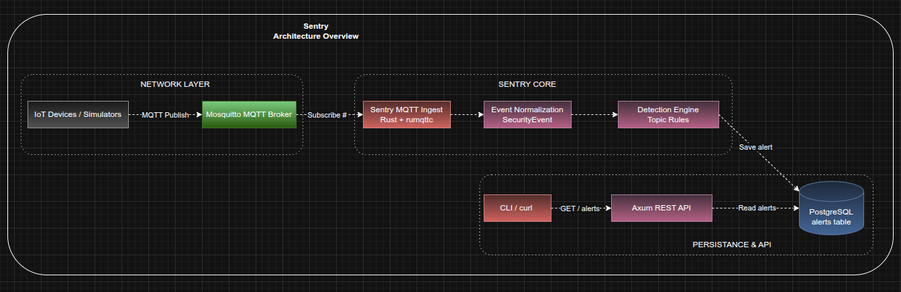
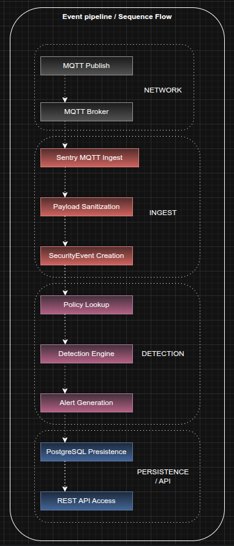

# Sentry

Sentry is an IoT IDS (Intrusion Detection System) and response platform written in Rust.

The project focuses on:
- MQTT telemetry ingestion
- Real-time detection of suspicious activity
- Alert generation
- PostgreSQL persistence
- REST API access to alerts

Sentry is being built as a learning-focused but production-inspired security platform for IoT, embedded systems, and distributed edge/fog environments.

---

# Current MVP Features

## MQTT Ingestion

Sentry subscribes to MQTT traffic using Mosquitto and ingests telemetry in real time.

Current ingest capabilities:
- Subscribe to MQTT topics
- Parse incoming messages
- Sanitize sensitive payloads
- Normalize telemetry before analysis

Example:

```text
devices/device-1/temp
admin/root/access
mesh/provisioning/hmac
```

---

## Detection Engine

Sentry currently includes a basic topic-based IDS rule engine.

Current detection capabilities:
- Unauthorized topic publish detection
- Topic allowlist enforcement
- Dynamic device ID extraction
- Real-time alert generation

Example detection flow:

```text
MQTT Publish
    ↓
SecurityEvent
    ↓
Detection Engine
    ↓
Alert
```

---

# PostgreSQL Persistence

Alerts are persisted using PostgreSQL + SQLx.

Current persistence flow:

```text
Alert
    ↓
SQLx
    ↓
PostgreSQL
```

Alerts are stored with:
- alert_id
- event_id
- device_id
- severity
- rule_name
- reason
- timestamp

---

# REST API

Sentry exposes a REST API using Axum.

Current endpoints:

```http
GET /alerts
```

Example:

```bash
curl localhost:3000/alerts
```
---

# Tech Stack

## Language
- Rust

## Networking / Telemetry
- MQTT
- Mosquitto
- rumqttc

## Backend
- Axum
- Tokio
- SQLx
- PostgreSQL

## Infrastructure
- Docker
- Docker Compose

---

# Architecture Overview



```text
MQTT Devices / Simulators
↓
Mosquitto MQTT Broker
↓
Sentry MQTT Ingest Layer
↓
Security Event Normalization
↓
Detection Engine
↓
PostgreSQL Persistence
↓
Axum REST API
```

---

# EventFlow Overview



# Project Goals

The goal of Sentry is to explore:
- IoT security
- IDS design
- Embedded/backend security workflows
- Event-driven architecture
- Async Rust systems programming
- Detection engineering

---

# Roadmap

## Current MVP
- [x] MQTT ingest
- [x] Topic-based detection
- [x] Alert persistence
- [x] REST API foundation
- [x] Live database-backed `/alerts`
- [ ] Device management
- [ ] Policy management
- [ ] Response/quarantine actions

## Future Ideas
- Web dashboard
- Rule engine expansion
- Device reputation scoring
- Alert severity scoring
- TLS/mTLS support
- Prometheus/Grafana integration
- Automated response workflows
- Distributed fog/edge deployment

---

# Development

## Run PostgreSQL

```bash
docker compose up -d postgres
```

## Run migrations

```bash
sqlx migrate run
```

## Start Sentry

```bash
cargo run
```

---

# Status

Sentry is currently in active MVP development.

The focus right now is building a clean and functional vertical slice before expanding the architecture further.